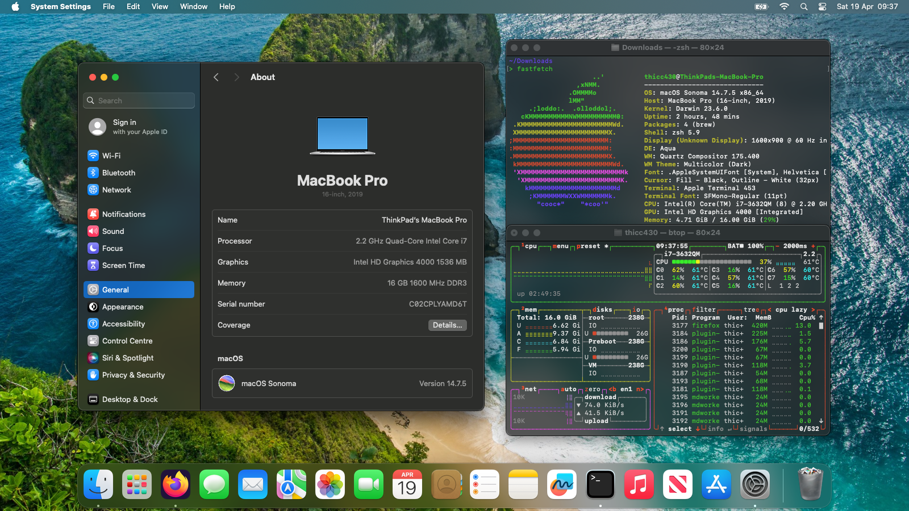

# T430 macOS Sonoma OpenCore

Download: https://github.com/moktavizen/t430-mac/releases

<table>
<tr>
<th>Specs</th>
<th>Features</th>
</tr>
<tr>
<td align="center" valign="top" width="441">

| Part      | Name             |
| :---------| :--------------- |
| Model     | ThinkPad T430    |
| Chipset   | 7 Series         |
| CPU       | Intel i7-3632QM  |
| GPU       | Intel HD 4000    |
| RAM       | 16GB             |
| Storage   | 256GB SSD        |
| Display   | 14 inch 1600x900 |
| Ethernet  | 82579LM          |
| WiFi      | Intel 6205       |
| Bluetooth | BCM20702         |
| Audio     | ALC3202          |

</td>
<td align="center" valign="top" width="441">

| Tested           | Untested   |
| :--------------- | :--------- |
| Power Management | Sleep[1] |
| iGPU             | Continuity[2] |
| WiFi             |            |
| Bluetooth        |            |
| Audio            |            |
| Camera           |            |
| Color Profile    |            |
| Night Shift      |            |
| USB Ports        |            |
| Keyboard         |            |
| Trackpad         |            |
| Trackpoint       |            |

</td>
</tr>
</table>

1. The battery health is already borked anyway.
2. I've never use it before.
